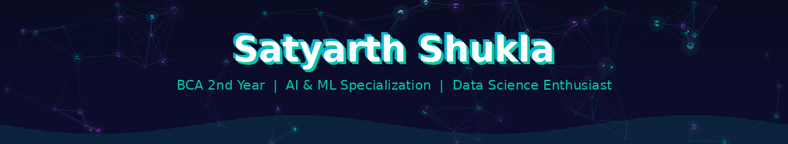

<div align="center">

<!-- Animated Header -->

  <defs>
    <linearGradient id="grad" x1="0%" y1="0%" x2="100%" y2="0%">
      <stop offset="0%" style="stop-color:#00C9A7;stop-opacity:1" />
      <stop offset="50%" style="stop-color:#00B4D8;stop-opacity:1" />
      <stop offset="100%" style="stop-color:#7B2FBE;stop-opacity:1" />
    </linearGradient>
  </defs>
  <rect width="1200" height="200" fill="url(#grad)"/>
  <path d="M0,140 C200,100 400,170 600,130 C800,90 1000,160 1200,120 L1200,200 L0,200 Z" fill="rgba(0,0,0,0.15)"/>
  <path d="M0,160 C300,120 600,180 900,140 C1050,120 1150,150 1200,145 L1200,200 L0,200 Z" fill="rgba(0,0,0,0.1)"/>
  <text x="600" y="95" font-family="Arial,sans-serif" font-size="52" font-weight="bold" fill="white" text-anchor="middle">
  <text x="600" y="135" font-family="Arial,sans-serif" font-size="18" fill="rgba(255,255,255,0.9)" text-anchor="middle">
</svg>

<!-- Typing animation -->
[](https://git.io/typing-svg)

</div>

---

## 🚀 About Me

```javascript
const satyarth = {
  education:      "BCA — 2nd Year, 4th Semester (AI & ML Specialization)",
  program:        "BCA (3-Year Degree) — Specialization: AI, ML & Data Science",
  location:       "Ujjain, Madhya Pradesh 🇮🇳",
  currentFocus:   "Machine Learning, Data Science & AI Applications",
  learning:       ["Python", "ML Algorithms", "AWS Bedrock", "Data Science"],
  collaborateOn:  "AI/ML projects, EdTech tools, Open Source",
  askMeAbout:     ["Python", "Machine Learning", "AWS", "Data Analysis"],
  funFact:        "I built a multi-workspace AI SaaS platform as a 2nd-year student! 🤯"
};
```

---

## 🛠️ Tech Stack

<div align="center">

**AI & Machine Learning**


**Cloud & Data**


**Web & Tools**


</div>

---

## 🌟 Featured Project

<div align="center">

### 🔭 Nebula AI — Multi-Workspace AI SaaS Platform

[](https://github.com/satyarthshukla500/Nebula-AI)

> 🤖 Built for the **AWS "AI for Bharat" Hackathon** (Track 4: AI for Learning & Developer Productivity)
>
> 9 AI Workspaces: General Chat • Explain Assist • Debug Workspace • Smart Summarizer • Quiz Arena • Interactive Quiz • Cyber Safety • Mental Wellness • Study Focus
>
> **Stack:** Next.js 14 · AWS Bedrock · DynamoDB · S3 · Rekognition · SageMaker · MongoDB Atlas · Supabase · Groq

</div>

---

## 📊 GitHub Stats

<div align="center">


</div>

<div align="center">

[](https://git.io/streak-stats)

</div>

---

## 🎯 Currently

- 🔭 Working on **Nebula AI** — AI SaaS with AWS Bedrock
- 🌱 Learning **Machine Learning, Data Science & Python**
- 💬 Ask me about **Python, ML, AWS, Data Analysis**
- 🤝 Looking to **collaborate on AI/ML & EdTech projects**
- ⚡ Fun fact: I built and deployed a full AI SaaS on AWS EC2 as a 2nd-year BCA student!

---

## 🤝 Connect With Me

<div align="center">

[](https://www.linkedin.com/in/satyarth-shukla-01a2a332a)
[](https://github.com/satyarthshukla500)

</div>

---

<div align="center">


*"Code is poetry, and I'm just getting started."* ✨

</div>
